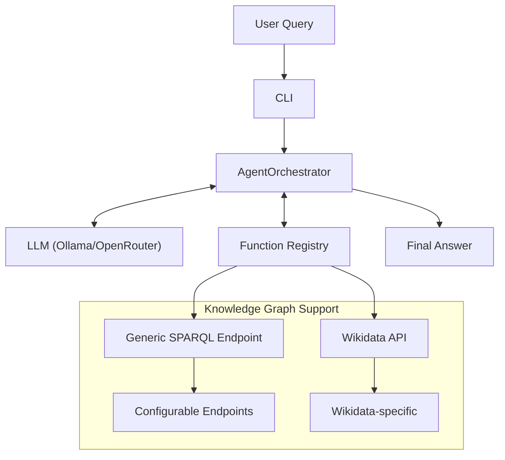
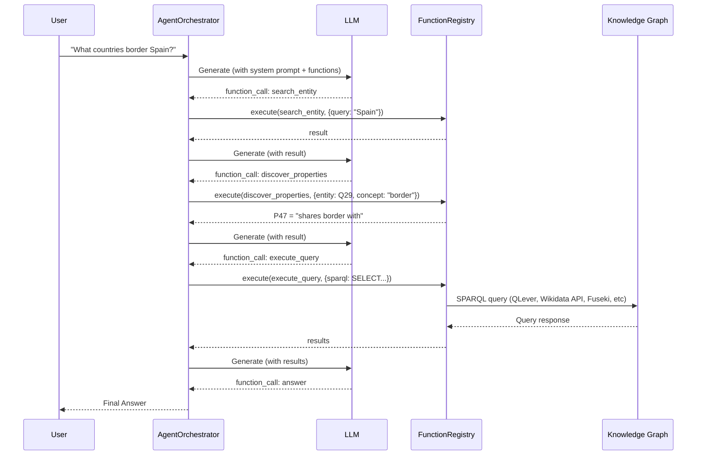
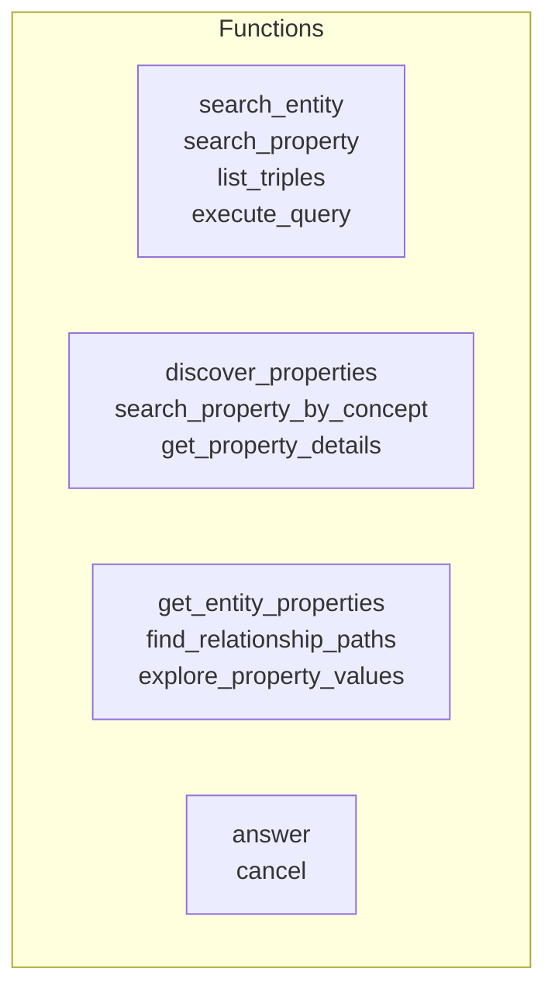

# System Architecture

## High-Level Flow

## Agent Loop

## Function Categories

## Key Components

| Component | File | Purpose |
|-----------|------|---------|
| AgentOrchestrator | src/agent/orchestrator.py | Main loop: LLM → functions → LLM |
| FunctionRegistry | src/functions/registry.py | Register & execute functions |
| LLM Clients | src/llm/*.py | Ollama / OpenRouter wrappers |
| WikidataClient | src/sparql/wikidata_search_client.py | Entity/property search |
| QLeverClient | src/sparql/qlever_client.py | SPARQL query execution |
